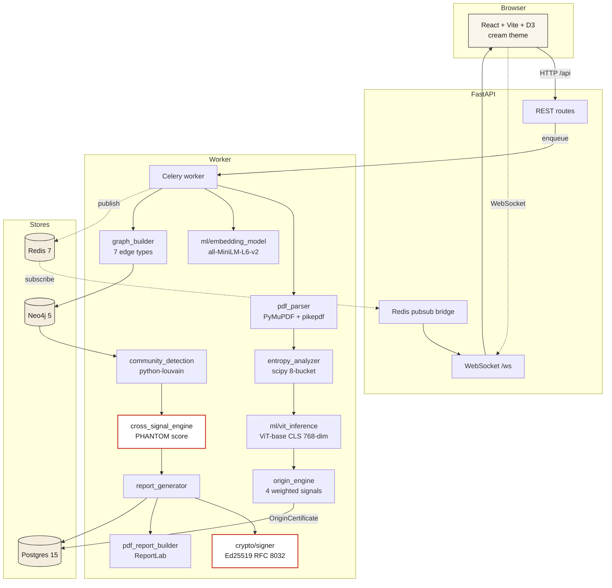

<div align="center">

# PHANTOM

**Fraud Ring & Document Origin Intelligence Platform**

*Every PDF leaves a fingerprint. We find the ring.*

Built for **SuRaksha Cyber Hackathon 2.0** · Canara Bank

</div>

---

PHANTOM is a dual-engine fraud detection platform that asks two questions no lending workflow asks together:

1. **Where was this document _born_?** Every PDF carries a forensic fingerprint — producer metadata, font subsetting, byte-level entropy, ViT visual embedding. A Canva-generated salary slip and a real Finacle-generated one look identical to the eye; their file-level fingerprints are completely different.
2. **Who else looks like this applicant?** PHANTOM builds a cross-applicant graph, runs Louvain community detection, and surfaces clusters that should not exist — same template, same timing, same valuer, same phone prefix, same free-text purpose.

When both signals agree, PHANTOM produces an **Ed25519-signed evidence bundle** — court-ready, tamper-evident, independently verifiable with the public key alone.

---

## The demo in one paragraph

Forty loan applications, all individually green. PHANTOM runs. On a cream canvas, eleven nodes turn red with a staggered cinematic reveal — same Canva 2.0 template, six-minute submission burst, shared phone prefix, near-duplicate names, verbatim "small business expansion" purpose, common valuer. The slide-in PHANTOM Report reads: **"11-applicant ring · 87.72% confidence · ₹6.23 crore exposure · FREEZE AND ESCALATE."** A signed PDF + JSON bundle is one click away. The pipeline ran in ~30 seconds, fully offline, on a laptop.

> Want to see the reveal without spinning up the backend? After `npm install` + `npm run dev`, open **http://localhost:5173/results?demo=mock**. A synthetic BATCH_COMPLETE payload drives the same D3 cinematic.

---

## Architecture



**Data flow** (40-document demo):

1. `POST /analyze/demo` enqueues a Celery batch task.
2. Per application: PDF parsing → entropy → ViT embedding → `score_document()` → `OriginCertificate` saved to Postgres. WebSocket fires `DOCUMENT_ANALYZED` 40 times.
3. Once all 40 are scored, `build_graph()` upserts Application nodes + 7 edge types into Neo4j. `GRAPH_BUILT` fires.
4. `detect_communities()` runs Louvain. `COMMUNITIES_DETECTED` fires.
5. Each suspicious cluster is scored by `score_cluster()` → `ClusterVerdict` → `generate_report()` → Ed25519-signed `PHANTOMReport`. `RING_DETECTED` fires per ring.
6. Final `BATCH_COMPLETE` carries the full graph + every report.

---

## How it works

### Engine 1 — Document origin

Each PDF gets an `OriginCertificate` with a single `cbs_match_score ∈ [0, 1]`. Four signals, weighted:

| Signal | Weight | Source |
|---|---|---|
| `tool_category` | **0.35** | PDF `/Producer` + `/Creator` strings → CBS / consumer / office / unknown |
| `entropy_profile` | **0.25** | 8-bucket Shannon entropy of raw bytes vs CBS reference centroid |
| `font_subsetting` | **0.20** | Fraction of fonts with `AAAAAA+` subset prefix (enterprise toolchains subset; Canva uses core fonts) |
| `vit_embedding` | **0.20** | ViT-base CLS-token cosine similarity vs CBS centroid |

If ViT is unavailable (timeout / model missing), its 0.20 weight redistributes equally to the other three and `confidence` drops accordingly.

The **CBS reference centroid** is built at startup from 100 synthetic CBS-style PDFs (`backend/seed/build_cbs_corpus.py`) — Finacle, TCS BaNCS, Oracle FLEXCUBE, Temenos producers, ReportLab + pikepdf metadata injection.

### Engine 2 — Cross-applicant network

Pairwise edges added to Neo4j between every application pair that triggers any of:

| Edge type | Trigger | Weight |
|---|---|---|
| `TEMPLATE_MATCH` | Same font-subset MD5, or perceptual-hash Hamming < 10 | **1.0** |
| `TEXT_MATCH` | sentence-transformer cosine > 0.70 | **0.8** |
| `SAME_GUARANTOR` / `SAME_VALUER` | Normalised name match | **0.7** |
| `SHARED_PII` | Weighted overlap > 0.40 (bank prefix, IFSC, phone prefix, domain, PAN prefix) | **0.6** |
| `NAME_SIMILARITY` | Levenshtein ≤ 2 OR token-sort ≥ 90 OR shared surname+initial | **0.5** |
| `TIMING_PROXIMITY` | \|Δsubmission\| < 10 min | **0.4** |

Louvain partitions the graph. Clusters with **size ≥ 3 AND ≥ one TEMPLATE_MATCH or TIMING_PROXIMITY edge** are flagged suspicious and forwarded to scoring.

### The PHANTOM score

```
behavioral_score   = 0.24·timing + 0.24·template + 0.12·size
                   + 0.15·pii   + 0.15·text     + 0.10·name

origin_match_score = 0.50·same_tool + 0.30·entropy_sim + 0.20·font_hash_match

PHANTOM            = 0.5·behavioral + 0.5·origin_match
```

Decision thresholds — `RecommendedAction`:

- `PHANTOM ≥ 0.85` → **FREEZE_AND_ESCALATE**
- `PHANTOM ≥ 0.65` → **FLAG_FOR_REVIEW**
- otherwise → `CLEAR`

Every component score, every weight, every member is captured inside the signed `EvidenceBundle`. Tamper with any field — a name, an amount, a timestamp — and the Ed25519 signature breaks.

---

## Tech stack

**Backend** · Python 3.11 · FastAPI · async SQLAlchemy 2.0 / asyncpg (Postgres 15) · Neo4j 5 + async driver · Celery 5 + Redis 7 · PyMuPDF · pikepdf · scipy · ImageHash · HuggingFace ViT-base · sentence-transformers `all-MiniLM-L6-v2` · python-louvain · networkx · cryptography (Ed25519) · ReportLab · loguru · pytest

**Frontend** · React 19 · Vite · TailwindCSS · Framer Motion · D3.js · react-router · react-dropzone · lucide-react · native WebSocket (no Socket.io)

**Infra** · Docker Compose (Postgres / Neo4j / Redis) · Ed25519 keypair stored under `./keys/`

**Optional** · Gemini 1.5 Flash for LLM-written narrative (template fallback ships and is the default)

Nothing in the demo path requires the internet. No paid services.

---

## Quick start

> Prerequisites: Docker Desktop, Python 3.11, Node 20+.

```powershell
# 1. Clone + enter
git clone <your-repo-url> phantom && cd phantom

# 2. One-time setup
python -m venv .venv
.\.venv\Scripts\Activate.ps1
pip install -r backend\requirements.txt
python backend\download_models.py          # ~540 MB, one time
copy .env.example .env

# 3. Build the CBS reference corpus + seed PDFs (one time)
python -m backend.seed.build_cbs_corpus
python -m demo_data.generate_demo

# 4. Frontend deps
cd frontend && npm install && cd ..
```

Then in **four terminals**:

```powershell
# Terminal 1 — infra
docker compose up postgres neo4j redis

# Terminal 2 — FastAPI
.\.venv\Scripts\Activate.ps1
python -m uvicorn main:app --reload --app-dir backend --host 0.0.0.0 --port 8000

# Terminal 3 — Celery worker (--pool=solo required on Windows)
.\.venv\Scripts\Activate.ps1
cd backend
python -m celery -A workers.celery_app worker --pool=solo --loglevel=info

# Terminal 4 — frontend
cd frontend
npm run dev
```

Open **http://localhost:5173**, click **Run Demo** (or press `D`), and watch the ring reveal itself.

---

## API endpoints

| Method | Path | Purpose |
|---|---|---|
| `GET` | `/health` | Liveness + readiness, Postgres/Neo4j pings, ML + narrative status |
| `POST` | `/analyze/demo` | Run the seeded 40-applicant demo (`?reset=true` to wipe + reseed) |
| `POST` | `/analyze/batch` | Analyse a freshly uploaded batch |
| `GET` | `/results/rings` | List all detected rings |
| `GET` | `/results/rings/{ring_id}` | Single ring report |
| `GET` | `/applications` | All applications + their certificates |
| `GET` | `/graph` | Latest Neo4j graph snapshot in D3 shape |
| `GET` | `/evidence/{ring_id}` | Signed evidence bundle (JSON) |
| `GET` | `/evidence/{ring_id}.pdf` | Court-ready ReportLab PDF |
| `GET` | `/evidence/public-key` | Ed25519 public key in PEM |
| `WS` | `/ws` | Real-time event stream |

Interactive Swagger UI at `http://localhost:8000/docs`.

---

## Verifying an evidence bundle

Anyone with the public key can verify a bundle independently — no need to trust PHANTOM.

1. Fetch the bundle: `GET /api/evidence/{ring_id}` → save as `bundle.json`
2. Fetch the key: `GET /api/evidence/public-key` → save `public_key_pem` as `phantom.pem`
3. Canonical-JSON encode the `evidence_bundle` field (`sort_keys=True`, `separators=(',',':')`, ISO timestamps), then verify the base64 `evidence_signature_ed25519` against the canonical bytes using the public key.

If any field has been modified — a name, an amount, a timestamp — the signature fails. The `signing_key_id` shown in the report (first 16 hex chars of SHA-256 of the raw public key) must match what `/evidence/public-key` returns.

---

## Tests

```powershell
.\.venv\Scripts\python.exe -m pytest backend\tests -v
```

**25 tests across 4 modules**, ~3 seconds, no DB / no network:

- `test_cross_signal.py` — synthetic fraud ring scores ≥ 0.85, synthetic clean cluster scores < 0.65, separation gap > 0.4, scores stay in `[0,1]`, empty input raises.
- `test_origin_engine.py` — weight tables sum to 1.0, consumer-tool penalty, font-subsetting monotonicity, entropy fallback, ViT-missing path, font-subset-hash determinism.
- `test_narrative_writer.py` — template includes ring size + cities + confidence verbatim, FREEZE/FLAG/CLEAR phrasing branches, Gemini-absent fallback is silent.
- `test_pdf_report_builder.py` — PDF starts with `%PDF-` and ends with `%%EOF`, all three action variants render.

---

## Project structure

```
phantom/
├── README.md                      # this file
├── DESIGN.md                      # full design rationale + scope decisions
├── docker-compose.yml             # Postgres + Neo4j + Redis (+ optional backend)
├── docker-compose.dev.yml         # infra-only stack for host-side dev
├── .env.example                   # copy to .env and fill
│
├── backend/
│   ├── main.py                    # FastAPI app + lifespan startup
│   ├── config.py                  # pydantic-settings, .env-driven
│   ├── logging_setup.py           # loguru (console + rotating file)
│   ├── download_models.py         # one-time ML model fetcher
│   ├── crypto/signer.py           # Ed25519 keypair + canonical-JSON signing
│   ├── database/                  # Postgres + Neo4j clients + ORM models
│   ├── schemas/                   # Pydantic models (Application, OriginCert, PHANTOMReport)
│   ├── services/
│   │   ├── pdf_parser.py          # PyMuPDF, font-subset detection
│   │   ├── entropy_analyzer.py    # 8-bucket Shannon entropy
│   │   ├── origin_engine.py       # weighted cbs_match_score
│   │   ├── pii_signals.py         # weighted PII overlap
│   │   ├── text_similarity.py     # sentence-transformer pair similarity
│   │   ├── name_match.py          # Levenshtein + token-sort
│   │   ├── graph_builder.py       # writes 7 edge types to Neo4j
│   │   ├── community_detection.py # Louvain partitioning + triage
│   │   ├── cross_signal_engine.py # PHANTOM score per cluster
│   │   ├── report_generator.py    # builds + signs PHANTOMReport
│   │   ├── narrative_writer.py    # template + optional Gemini Flash
│   │   └── pdf_report_builder.py  # ReportLab PDF export
│   ├── ml/                        # ViT + sentence-transformer wrappers (lazy)
│   ├── api/                       # WebSocket manager + Redis bridge + routes
│   ├── workers/                   # Celery app + tasks + Redis event publisher
│   ├── seed/                      # CBS corpus builder + demo data seeder
│   └── tests/                     # 25 pytest cases
│
├── frontend/
│   ├── index.html
│   ├── vite.config.js
│   ├── tailwind.config.js
│   └── src/
│       ├── App.jsx                # routes + ErrorBoundary
│       ├── index.css              # cream theme tokens + Tailwind layer
│       ├── theme/                 # JS mirror of Tailwind palette
│       ├── lib/                   # fetch wrapper + formatters
│       ├── hooks/                 # useWebSocket + useAnalysis + keyboard
│       ├── pages/                 # Landing, Upload, Results
│       ├── components/            # FraudGraph (D3), PhantomReport, OriginTree, …
│       └── data/demo_dataset.js   # offline mock BATCH_COMPLETE payload
│
├── demo_data/
│   ├── applicants.json            # 40 pre-baked Indian-name applicants
│   ├── generate_demo.py           # ReportLab + pikepdf PDF generator
│   └── pdfs/                      # generated (gitignored)
│
├── keys/                          # Ed25519 keypair (gitignored)
├── models/                        # HuggingFace cache + CBS reference (gitignored)
├── logs/                          # loguru rotating sink (gitignored)
└── scripts/ws_sniffer.py          # dev tool: tail the WebSocket as JSON
```

---

## Keyboard shortcuts

| Key | Action |
|---|---|
| `D` | Fire the seeded demo |
| `R` | Replay the cinematic reveal |
| `Esc` | Close drawers / dialogs |
| `?` or `/` | Open keyboard shortcut help |

Shortcuts are inert while focus is inside a form field.

---

## Honest limits

In the spirit of straight pitching:

- PHANTOM is **not** a trained ML classifier. ViT and sentence-transformer pieces are supporting features; the brain is rule-based forensics + Louvain. The detection is deterministic, not statistical.
- It does **not** detect rings that share no document, no PII, no text, no timing, no name overlap. Such rings would be invisible to any system.
- It does **not** include user auth, multi-tenant isolation, or production-readiness work a real bank deployment would need.
- The CBS reference corpus is currently 100 **synthetic** CBS-style PDFs we generate. In production this would be rebuilt from a bank's actual genuine documents — typically 500–1000 PDFs — in under an hour.
- The LLM (Gemini Flash) is **never** load-bearing. Narrative paragraphs are templated by default and only swap in Gemini output if a `GEMINI_API_KEY` is set and the call succeeds in under 5 seconds. The demo cannot fail because of a third-party API.

---

## Design rationale

The full design document — including dependency choices, scope decisions, the multi-signal upgrade rationale, the CBS reference corpus build plan, and what was deliberately cut — lives in [**DESIGN.md**](DESIGN.md).

---

## License

Built for SuRaksha Cyber Hackathon 2.0. No external code re-used beyond the open-source dependencies declared in `backend/requirements.txt` and `frontend/package.json`. Ed25519 implementation via [`cryptography`](https://cryptography.io/). ViT weights via HuggingFace [`google/vit-base-patch16-224`](https://huggingface.co/google/vit-base-patch16-224).
